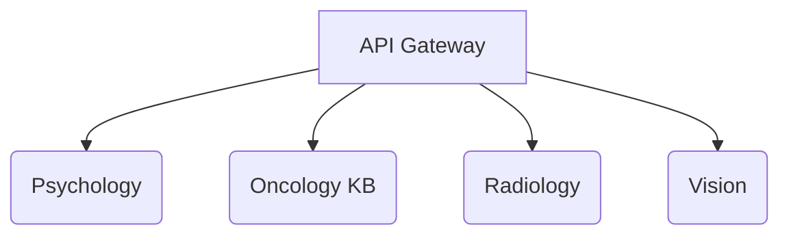

# xiaoXBao MCPs

This repository provides several minimal medical copilots (MCPs) written in FastAPI.



## Setup

```bash
poetry install
export DEEPSEEK_API_KEY=xxx
export GEMINI_API_KEY=xxx
```

## Development

Useful make targets:

- `make lint` – run black, isort and flake8
- `make test` – run pytest
- `make run` – start the API gateway

Environment variables are loaded from `DEEPSEEK_API_KEY` and `GEMINI_API_KEY`.
